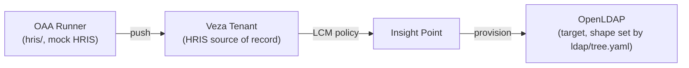

# lcm-local-lab

A one-click local lab for testing Veza Lifecycle Management (LCM): a mock HRIS
source of record (joiner/mover/leaver scenarios) feeding into an OpenLDAP target
system, registered with your Veza tenant via a Veza Insight Point.



Only Homebrew, Colima, and Docker are required on the host — the HRIS push and the
LDAP bootstrap data generation both run as one-shot containers, not local Python.

## One-time setup: create a Veza Insight Point

`DP_REGISTER_KEY` (needed for `.env`, below) comes from a Veza Insight Point you
register once per Veza tenant — it isn't something you invent locally, and it's
separate from `VEZA_API_KEY`. The `insight_point` container in this lab uses it to
register itself and open its outbound tunnel to your tenant. Do this once; the same
key is reused across every `make down` / `make up` after that.

1. Log in to the Veza console with an administrator account.
2. Go to **Integrations → Insight Points**.
3. Click **Create**.
4. Enter a **Name** for this Insight Point (e.g. `lcm-local-lab`).
5. Click **Generate Key**.
6. Copy the key immediately — **Veza cannot show it to you again if you lose it.**
7. Paste it into `.env` as `DP_REGISTER_KEY` (see Quickstart below).

There's no further "activate" step on the console side. The next time `make up`
starts the `insight_point` container, it registers itself with that key and should
show status **OK** on the Insight Points page within a minute or so — subject to the
Zscaler caveat in Troubleshooting below, which affects the online indicator but not
registration itself.

If you lose the key: create a new Insight Point entry (or regenerate on the existing
one, if your console offers it), copy the new key into `.env`, then
`docker compose up -d insightpoint --force-recreate` (or `make down && make up`) to
pick it up.

## Quickstart

```bash
git clone --recurse-submodules <this-repo-url>
cd lcm-local-lab
cp .env.example .env && chmod 600 .env
# edit .env: fill in VEZA_URL, VEZA_API_KEY, DP_REGISTER_KEY (see "One-time setup" above), LDAP_ADMIN_PASSWORD

make install   # Homebrew/Colima/docker/docker-compose if missing, submodules, start Colima
make up        # render ldap/tree.yaml -> bootstrap.ldif, bring up openldap + phpldapadmin + insight_point
make verify    # smoke-check: compose ps, ldapsearch, phpLDAPadmin, insight_point logs
```

Forgot to `--recurse-submodules`? `make install` also runs `git submodule update --init`.

Then push HRIS scenarios (see [hris/README.md](hris/README.md) for the full persona list and
expected results):

```bash
make hris-validate
make hris-run SCENARIO=baseline              # local build only
make hris-run SCENARIO=baseline PUSH=true    # push to VEZA_URL
```

phpLDAPadmin: http://localhost:8081 (login as `cn=admin,<LDAP_BASE_DN>`).

## Parameters

Everything environment-specific lives in two places:

- **`.env`** — `VEZA_URL`/`VEZA_API_KEY`/`VEZA_URL_ALLOWLIST`/`DP_REGISTER_KEY` (which Veza tenant,
  and how the HRIS/Insight Point connect to it), plus `LDAP_BASE_DN`/`LDAP_DOMAIN`/
  `LDAP_ORGANISATION`/`LDAP_ADMIN_PASSWORD` (the LDAP server's identity) and `LCM_SCENARIO`.
- **`ldap/tree.yaml`** — the OpenLDAP tree shape: organizational units, starting empty of users by
  design (the LCM Joiner workflow is what creates them — see `hris/README.md`). Edit this to model
  a different org structure; the DNs are built from `LDAP_BASE_DN` at render time, so you don't
  need to touch `LDAP_BASE_DN` and `tree.yaml` in sync by hand.

After changing `ldap/tree.yaml` (or `LDAP_BASE_DN`/`LDAP_DOMAIN`), run `make reset` — osixia/openldap
only applies bootstrap data on an empty database, so `make up` alone won't pick up the change on a
stack that's already been initialized once.

## Layout

```
.env.example              copy to .env — see Parameters above
docker-compose.yml          openldap, phpldapadmin, insight_point (long-running)
                             + renderer, hris (one-shot, profile "tools")
Makefile                    install / render / up / down / reset / verify / hris-validate / hris-run / clean
ldap/
  tree.yaml                  edit this to change the LDAP org structure
  custom.schema               defines the is-active attribute + accountStatus objectClass
  .generated/                 gitignored; render output
scripts/
  install_deps.sh              Homebrew/Colima/docker bootstrap (make install)
  render_ldap_bootstrap.py    tree.yaml -> ldap/.generated/bootstrap.ldif
  verify.sh                    make verify
oaa-hris/
  oaa-runner-internal/         git submodule; the HRIS push's Dockerfile/runit.sh come from here
hris/                        the mock HRIS connector (see hris/README.md)
```

## Troubleshooting

- **No sudo / Homebrew installer fails with "Insufficient permissions to install Homebrew to
  /opt/homebrew"**: `install_deps.sh` falls back to installing Homebrew into `$HOME/homebrew`
  instead (no sudo required). Add `export PATH="$HOME/homebrew/bin:$PATH"` to your shell profile
  afterward so `brew`/`colima`/`docker` keep working in new terminal sessions.
- **Insight Point registers (logs show an `edp_id` and "Successfully reported info to control
  plane") but still shows offline in the Veza console**: check `docker logs insight_point` for a
  repeating `tunnel_client.go ... rpc error: code = Unavailable ... failed to read frame header:
  EOF` pattern, reconnecting every couple of minutes. That's a corporate proxy/firewall (e.g.
  Zscaler) killing the long-lived gRPC/HTTP2 tunnel the console relies on for the online indicator,
  while short HTTPS calls still succeed. This needs a network-team exception for that persistent
  tunnel to `*.vezacloud.com:443` — it isn't fixable from this repo.
- **`make up` succeeds but `ldapsearch` doesn't show a `tree.yaml` edit**: run `make reset`, not
  `make up` — see Parameters above.
- **Fresh clone, `hris` container build fails / `oaa-hris/oaa-runner-internal` is empty**: run
  `git submodule update --init --recursive` (or re-run `make install`, which does this).
