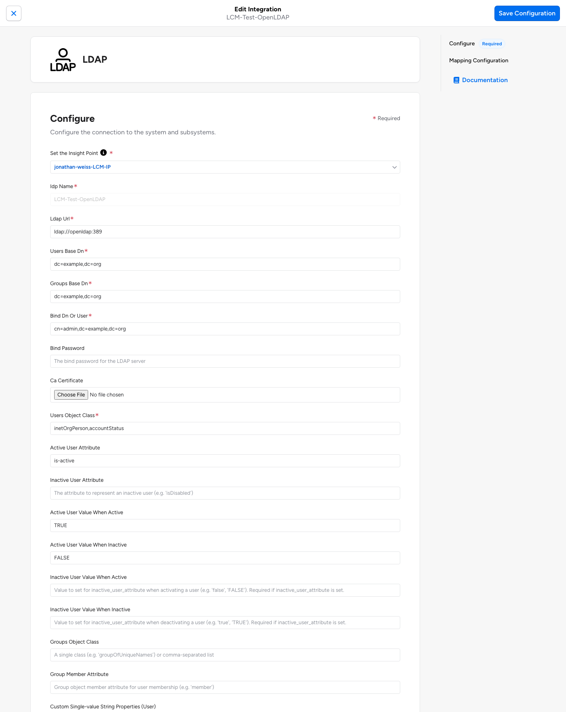

# LCM-Test-HRIS

A dummy HRIS source, built with OAA Runner, for testing Veza Lifecycle Management
birthright (joiner/mover/leaver) policies. All data is fictional and comes from
`fixtures/<scenario>.json` through the OAA Runner mock framework. There is no real
HRIS behind it.

Setup (installing dependencies, filling in `.env`, bringing up the stack) is covered
by the root [README.md](../README.md) — this file only covers what's specific to the
HRIS piece once the lab is up.

## Layout

```
config.yaml                     HRIS provider, Employee + Group sources (all mapping in YAML)
modules/lcm_test_hris.py        fetch(): BaseURLSession + maybe_mock_it + lazy_dict_table
modules/lcm_test_hris_mocks.py  @mock_response for /employees and /groups; picks fixture by LCM_SCENARIO
modules/lcm_test_hris_hooks.py  PRE_RUN guard: refuses any run unless VEZA_URL host is allowlisted
fixtures/{baseline,joiner,mover,leaver,rehire,convert}.json
requirements.txt                extra Python deps for this connector; installed inside the hris
                                 container automatically (see root docker-compose.yml / Dockerfile)
```

This runs as the `hris` service in the root `docker-compose.yml`, built from the
`oaa-runner-internal` submodule's own `Dockerfile`+`runit.sh` — there's no local
Python/`uv` setup for this piece; `make hris-validate` / `make hris-run` (from the repo
root) drive it.

## Personas

| ID | Persona | Baseline | Change |
|---|---|---|---|
| E1001 | Root manager, very long hyphenated name | active FTE, Leadership | — |
| E1002 | Siobhán O'Connor: FTE (apostrophe, accent) | active, Engineering / Software Engineer | — |
| E1003 | José Núñez: FTE (accents), later FTE → contractor | active, Finance / Financial Analyst | `convert` → `employment_types: [CONTRACTOR]`, job_title "Financial Analyst (Contract)" |
| E1004 | Priya Raman: contractor, later contractor → FTE | active, `employment_types: [CONTRACTOR]` | `convert` → `employment_types: [FULL_TIME]`, job_title "QA Engineer" |
| E1005 | Anne-Marie Dubois-Laurent: mover (hyphens) | active, Sales / Account Executive | `mover` → Engineering / Solutions Engineer |
| E1006 | Kenji Watanabe: leaver | active, Support | `leaver` → terminated, termination_date 2026-10-01 |
| E1007 | Olu Adeyemi: already terminated, later rehired | terminated | `rehire` → active, new hire_date |
| E1008 | Zoë Åkesson: pre-hire joiner | `pre-hire`, `is_active: false`, start 2026-10-05 | `joiner` → active |
| E1009 | Mateus Ferreira: new hire | (absent) | `joiner` → added, active |

Every employee has `is_test_account = true`, an `@example.com` email, membership in the
`LCM-Test` group, and a `LCM-Test <Function>` department. Managers point only at fake employees.

Scenarios are cumulative: baseline → joiner → mover → leaver → rehire → convert, each the
previous dataset plus one or two changes. Run them in that order.

Attributes a birthright rule can use: `department`, `job_title`, `work_location`,
`employment_types` (FULL_TIME / CONTRACTOR), `managers`, `start_date` (hire date),
`employment_status`, and `is_active` (true only when `employment_status == active`).
Custom properties: `hire_date`, `employment_type` (FTE / Contractor), `is_test_account`, `persona`.

## Run sequence (per scenario, from the repo root)

```bash
# 1. Validate (also tests connectivity to VEZA_URL)
make hris-validate

# 2. Local build, no Veza contact; writes hris/lcm-test-hris-<timestamp>.json
make hris-run SCENARIO=baseline        # then joiner, mover, leaver, rehire, convert

# 3. Inspect the payload
f=$(ls -t hris/lcm-test-hris-*.json | head -1)
jq '.employees | length' "$f"
jq -r '.employees[] | "\(.id)\t\(.employment_status)\tactive=\(.is_active)\t\(.department.id)\t\(.job_title)"' "$f"
jq '[.employees[] | select(.custom_properties.is_test_account != true)] | length' "$f"   # expect 0
jq '.employees[] | select(.id == "E1008")' "$f"   # joiner;  E1005 for mover, E1006 for leaver, E1007 for rehire, E1003/E1004 for convert

# 4. Push to the sandbox (only after review)
make hris-run SCENARIO=baseline PUSH=true    # then joiner, mover, leaver, rehire, convert
```

Expected results:

| Scenario | Employees | active / pre-hire / terminated |
|---|---|---|
| baseline | 8 | 6 / 1 / 1 |
| joiner | 9 | 8 / 0 / 1 |
| mover | 9 | 8 / 0 / 1 |
| leaver | 9 | 7 / 0 / 2 |
| rehire | 9 | 8 / 0 / 1 |
| convert | 9 | 8 / 0 / 1 |

Notes:
- `--dry_run=True` is not offline: it still looks up the provider in Veza and creates it if it
  doesn't exist. `make hris-run` without `PUSH=true` uses `--no_push=True` instead for local checks.
- Expect identity-mapping warnings on push. The fake emails won't match any IdP identity.
  They are not failures.
- `oaa validate_payload` targets CUSTOM_APP payloads and misreports HRIS ones (0 LocalUsers).
  Use the jq checks above instead.

## Setting up the LCM policy

Everything below is one-time console setup, done after the lab is up (root README's Quickstart)
and after `LCM-Test-HRIS` exists as a Veza provider (see the note on that below).

### 1. `LCM-Test-HRIS` as an LCM source

`app.options.provisioning: true` is sent in the provider-create call, which makes the provider
selectable as an LCM source (Lifecycle Management → Policies → Create Policy → Configure Source).
It applies **only when the provider is first created** — this happens on the first **real** push
(`make hris-run SCENARIO=baseline PUSH=true`); a `--no_push` build-only run never creates the
provider. If `LCM-Test-HRIS` already exists without `provisioning: true` (e.g. it was created by
an earlier `--no_push` experiment against an older `oaa-runner` version, or manually), it has to be
deleted and re-created in the Veza console for this flag to apply.

**Shared tenant note**: if several people share one Veza tenant, set `LCM_PROVIDER_SUFFIX` in
`.env` (e.g. `-jw` for your initials) **before your first push** — `config.yaml` interpolates it
into both the provider name and `datasource`, so the provider is created disambiguated from the
start (e.g. `LCM-Test-HRIS-jw`). Don't rename the provider in the console after the fact instead:
a rename there doesn't change `provisioning: true`, but push-to-update matching relies on the name
staying stable across runs, and a console rename can make the next push create a duplicate rather
than update the existing provider. When building the policy in step 4 below, select the provider
under whatever name it actually has in your console (plain `LCM-Test-HRIS` if you left
`LCM_PROVIDER_SUFFIX` empty).

### 2. Register `openldap` as an LDAP integration

In the Veza console, go to **Integrations → Add Integration**, search for "LDAP", and configure
it with this lab's specifics:

| Field | Value | Why |
|---|---|---|
| Insight Point | the one created in the root README's "One-time setup" | lets Veza reach `openldap`, which isn't publicly exposed |
| IDP Name | `LCM-Test-OpenLDAP` (or similar) | internal identifier only |
| LDAP URL | `ldap://openldap:389` | `openldap` is the container hostname on the `ldap_network` Docker network the Insight Point shares with it; `LDAP_TLS=false` in `docker-compose.yml`, so no `ldaps://`/CA cert for this lab |
| Users Base DN | `$LDAP_BASE_DN` (e.g. `dc=example,dc=org`) | covers every OU in `ldap/tree.yaml`, not just one |
| Groups Base DN | `ou=Groups,$LDAP_BASE_DN` | `ldap/tree.yaml` seeds its example groups (Engineering, Finance, VPN-Users) under this OU |
| Bind DN or User | `cn=admin,$LDAP_BASE_DN` | osixia/openldap's auto-created admin account |
| Bind Password | `$LDAP_ADMIN_PASSWORD` | from `.env` |
| Users Object Class | `inetOrgPerson,accountStatus` | **both**, per the comment at the top of `ldap/custom.schema` — `accountStatus` is the AUXILIARY class carrying `is-active`; omitting it from this list means the connector's search filter won't match these users |
| Groups Object Class | leave default (`groupOfUniqueNames`) | matches the object class `ldap/tree.yaml`'s groups are seeded with |

Click **Create Integration** and wait for the first extraction to succeed — required before this
integration can be used as an LCM target.



### 3. Enable provisioning on it

1. Open the `LCM-Test-OpenLDAP` integration → **Edit**.
2. Check **Enable usage for Provisioning** → **Save Configuration**.
3. Set the activation-detection strategy to match `ldap/custom.schema`'s `is-active` attribute
   (Strategy A — `is-active` is a positive "active" flag, not an "inactive/locked" one):
   - `active_user_attribute`: `is-active`
   - `active_user_value_when_active`: `TRUE`
   - `active_user_value_when_inactive`: `FALSE`

   (matches the literal strings `scripts/render_ldap_bootstrap.py` writes — `is-active: TRUE` /
   `is-active: FALSE`.)

### 4. Create the policy, with separate Joiner, Mover, and Leaver workflows

1. **LCM → Policies → Create Policy.**
2. Name it (e.g. `LCM-Test: HRIS birthright → OpenLDAP`), and select your `LCM-Test-HRIS` provider
   (whatever it's actually named in your console — see the shared-tenant note above) as the
   **Primary Identity Source**.
3. In the draft policy's **Workflows** tab, create three separate workflows — one per lifecycle
   event — rather than one workflow trying to do everything. This is Veza's recommended structure:
   each workflow gets its own trigger condition and its own action, so a leaver can't accidentally
   re-create an entry and a mover can't accidentally deactivate one.

This lab uses **one fixed OU for every synced employee** regardless of department — the common
real-world pattern unless an org is geographically distributed (region/country OUs), which this
lab doesn't model. `ldap/tree.yaml` defines `Employees` for this; `IT`/`Marketing` are unrelated
example OUs, not an LCM target. `ldap/tree.yaml` seeds **no users at all** — every LDAP entry that
exists is one these workflows created, which is the point of the lab.

Across all three workflows, trigger conditions are SCIM filter expressions over the HRIS fields
`hris/config.yaml` maps (`is_active`, `employment_status`, `department`, `job_title`, …), and every
Sync Identities / Deprovision Identity action uses the same **Action Unique Identifier**: `id` (the
DN below) — HRIS's `unique_id`/`employee_number` isn't itself an LDAP identifier, so this DN
Formatter is what ties a given employee to a given LDAP entry across runs and across workflows.

#### Joiner — create or reactivate an entry

| Setting | Value |
|---|---|
| Trigger: Identity matches this condition | `is_active eq true` |
| Trigger: Identity newly matches the condition | checked — fires once on every false/absent → true transition, which covers both a brand-new hire (E1009) and a rehire (E1007's `rehire` scenario), not a separate fourth workflow |
| Action | Sync Identities |
| Don't create new users | unchecked — this workflow's whole job is to create the entry |
| Update only on create or reactivate | checked — Joiner only writes attributes at creation/reactivation time; keeping this on is what stops Joiner and Mover from fighting over the same fields on every extraction |

Action Synced Attributes (full population at creation time):

| Destination attribute | Formatter (source → value) | Why |
|---|---|---|
| `id` (the DN) | `uid={employee_number},ou=Employees,dc=example,dc=org` | replace `dc=example,dc=org` with your actual `$LDAP_BASE_DN`; the only universally required attribute for LDAP user creation |
| `uid` | `{employee_number}` | LDAP convention expects the entry to also carry the attribute matching its own RDN |
| `cn` | `{full_name}` | required by `inetOrgPerson` |
| `sn` | `{last_name}` | required by `inetOrgPerson` |
| `mail` | `{email}` | |
| `title` | `{job_title}` | standard `organizationalPerson` attribute — no `custom.schema` change needed |
| `departmentNumber` | `{department}` | standard `organizationalPerson` attribute — no `custom.schema` change needed |

Not mapped here on purpose: `is-active`. Per Veza's LDAP provisioning docs, a Sync Identities
action's create/reactivate path is itself one of the "activate" actions that writes the LDAP
integration's configured activation attribute to its configured active value — so a newly created
or rehired entry should get `is-active: TRUE` automatically from the **User Activation Detection**
settings in step 3 above, with nothing extra to map. Verify this on your first dry run; if a newly
created entry comes back without `is-active` set, add it explicitly here as a Boolean-formatted
synced attribute instead. Also not yet verified empirically: whether a newly-created entry
automatically gets the `accountStatus` auxiliary class (needed for `is-active` to be settable at
all) from the integration's configured Users Object Class, or needs its own `objectClass` mapping —
check this first if deactivation later fails on a newly-created user.

#### Mover — update attributes on an existing, active entry

| Setting | Value |
|---|---|
| Trigger: Identity matches this condition | `is_active eq true` |
| Trigger: Identity properties | Have changed → Specific properties: `department`, `job_title` |
| Action | Sync Identities |
| Don't create new users | checked — Mover only ever updates an entry Joiner already created; if it somehow ran first, skip rather than create a partial entry |
| Update only on create or reactivate | unchecked — the opposite of Joiner: Mover's whole job is to push attribute changes to an already-active entry |

Action Synced Attributes: just the attributes that can change — `title` and `departmentNumber`,
same formatters as Joiner's above. (`id` stays as the Action Unique Identifier, not a synced
attribute to recompute — an employee's DN doesn't move with them in this lab's one-OU design.)

This same workflow also covers the `convert` scenario (E1003/E1004, FTE ↔ contractor): it's a
`job_title` change on an already-active identity, same as a department move — no fourth workflow
needed.

One overlap to expect, not a bug: per Veza's Lifecycle Management FAQ, a brand-new identity has
every property treated as "changed," so on a new hire's first extraction this Mover workflow's
trigger properties are satisfied too, alongside Joiner's. That's harmless here — Mover's "Don't
create new users" means it has nothing to do until the entry Joiner just created exists, and
re-syncing the same `title`/`departmentNumber` values a moment later is a no-op.

#### Leaver — deactivate without deleting

| Setting | Value |
|---|---|
| Trigger: Identity matches this condition | `employment_status eq "terminated"` |
| Trigger: Identity newly matches the condition | checked — fires once on the active → terminated transition (E1006) |
| Action | **Deprovision Identity** — not Sync Identities |
| Entity Type | LDAP User |
| Remove all entitlements | unchecked for this lab, pending Access Profile setup — revisit once leavers can actually hold group entitlements to remove |

Deprovision Identity is Veza's dedicated disable action: it writes the LDAP integration's
configured activation attribute to its configured inactive value (`is-active: FALSE`, per the
**User Activation Detection** settings in step 3 above) and preserves the entry and its history,
rather than deleting it (that's what the separate, much more destructive Delete Identity action is
for — not used anywhere in this lab). This is what actually flips `is-active` for E1006; the
previous single-workflow version of this lab didn't handle deactivation at all.

4. Dry-run each of the three workflows against a representative HRIS identity, publish the
   version, then **LCM → Policies → (policy) → ⋮ → Enable**. Policies run on source extraction — a
   dry run does not test LDAP connectivity.
